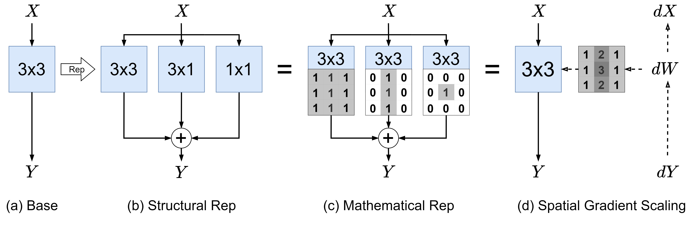

# Reparameterization through Spatial Gradient Scaling

Official implementation of "Reparameterization through Spatial Gradient Scaling".




## CIFAR-100

### VGG-11
```console
CUDA_VISIBLE_DEVICES=0 python tools/train.py -c configs/strategies/SGS/wei_cifar.yaml --model wei_vgg11_bn --dataset cifar100 --experiment cifar100_wei_vgg11_bn_nmi5 --sgs --data-path ~/datasets/CIFAR --dist-port 29500
```

| **Model**     | **Baseline**  | **Paper**     | **This Repo**     |
|---------------|---------------|---------------|-------------------|
| VGG-11        | 70.8±0.1      | 73.2±0.1      | 73.4±0.1          |
| VGG-16        | 74.9±0.1      | 76.2±0.1      | 76.7±0.1          |
| ResNet-18     | 77.8±0.1      | 78.8±0.1      | 78.6±0.1          |

| **Model**     | **Baseline (GPUs hours)** | **Ours (GPUs hours)** |
|---------------|---------------------------|-----------------------|
| VGG-11        | 0.62                      | 0.65                  |
| VGG-16        | 0.83                      | 0.89                  |
| ResNet-18     | 1.02                      | 1.15                  |

## ImageNet
```console
bash tools/dist_train.sh 8 configs/strategies/SGS/resnet.yaml resnet18 --experiment imagenet_res18_sgs --sgs --data-path ~/datasets/ImageNet --dist-port 29500
```

| **Model**     | **Baseline**  | **Paper**     | **This Repo**     |
|---------------|---------------|---------------|-------------------|
| ResNet-18     | 71.13±0.04    | 71.65±0.05    | 71.62             |
